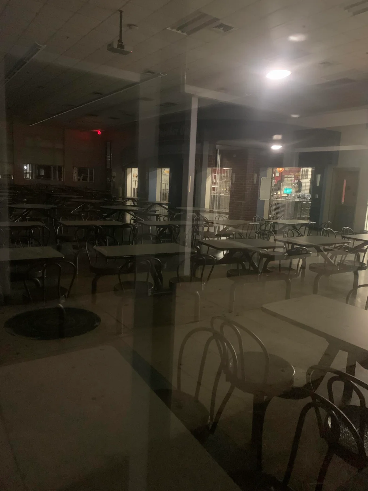
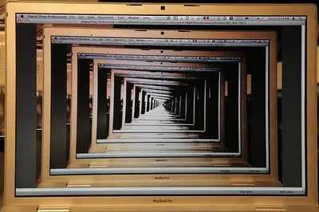
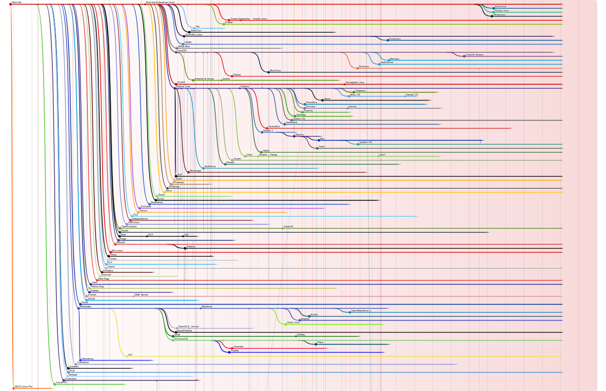

+++
title = 'What is a liminal recursion?'
date = 2025-12-01T19:45:11-05:00
draft = false
categories = ["essays-reflection"]
tags = ["liminality", "recusion", "education", "philosophy"]
image = "featured.jpg"
+++


# **Liminal:**
/ˈlɪm.ɪ.nəl/

***Between or belonging to two different places, states, etc.***
# **Recursion:**
/rɪˈkɜː.ʒən/

***The process of embedding an expression or experience of some type within an expression of the same type.*** 


I came to the title of the blog accidentally on purpose. I wrote a lot about liminality in my Mater's thesis and how it relates to classroom education. Liminality suggests an in-between space that could be physical or psychological, or both. 

>Liminality offers a powerful educational metaphor for attitudes, pedagogies, 
>practices, and even whole institutions “that escape the confines and constraints of >the centre” (Conroy, 2004).

When I write here, I recognize that everything exists in a state of liminality. A threshold, an in-between state, never truly arriving anywhere. If everything is simultaneously changing while still being fuzzy, this has to include my ideas, too.  Unable to be completely pinned down. I can attempt to write about, discuss, or define any given experience, but any attempt to do so is inherently incomplete. That can be unsettling to recon with, but also freeing, in a way, since I don't need to be saddled with the burden of getting it right.

In pop culture, liminal spaces are often described as in between locations. Like, being in a space that feels... wrong, or outside of normal expectations. Like being in the middle of an empty swimming pool. Or a quiet school cafeteria at night.

We exist liminally. Yea yea I also need to walk to and from work, pick up groceries, pay bills. But describing acts in those terms is a form of categorization. They help to package, bookend, either prospectively or in retrospect, all parts of experience and always keep us in the center. But language like this tends to lend itself to a reductionism that we all accept and not think much more about because it's convenient. Really, our lives exist just as much in the blurred boundaries between what we think we need to do and what gets done. Who/what we are and who/what we want to be. In what we see and what we feel. In what we feel and what we say. In what we think and what we're able to express. Experience is never exactly right, never A to B. There's always more occurring than we're able to hold on to. Even in those fleeting moments where we *think* everything is perfect, there's a built-in imperfection: the moment won't last. Perfect moments never do. Always moving. Always changing. Always blurry.

And yet, we're always also so self-referential. No matter how many times we say we're going to be *a whole new me,* try to redefine ourselves, we can never quite get there. We can't ever be a whole new person. Because we are what we experience, any *new* experience has to come back, interact, interface, and negotiate with what and who we already are. It's recursive. 
 
We think about thinking. I notice that I am anxious, and then become anxious about my anxiety. Frustrated with it. I want a new overcoat that embraces this new style I'm going for. The overcoat needs to fit, in some way, on my existing body, which has always worn other types of coats. I've developed specific habits and biases toward some kinds of clothing and not other kinds. I might do research on coats, making decisions about already-established preferences that could even be unconscious. I go to try some coats on that I've selected and feel uncomfortable in this new style of coat. And even if I say the discomfort is okay, is part of the process, there's likely a threshold of just how much discomfort of the new, versus the comfort of the past that I will allow myself. The present always pulls from the past which pulls from the past which pulls from the past.

Wrapping these ideas together, a liminal recursion describes experiencing life in unfamiliar, familiar territory. I don't have my shit figured out yet, but none of us do and none of us ever fully will. Being okay with that, with wandering around in unfamiliar experiences that vaguely resemble what we know or trust. Or maybe in familiar experiences that are different forks--to borrow a word from tech--of experiences past that are so deeply past that we get a sense of deja vu. 

Whatever the case, accepting liminal recursions allows me the freedom of writing in this blog unencumbered of the burden of perfection. Walking through words for walking's sake. Who knows what I may trip over, and over, and over.